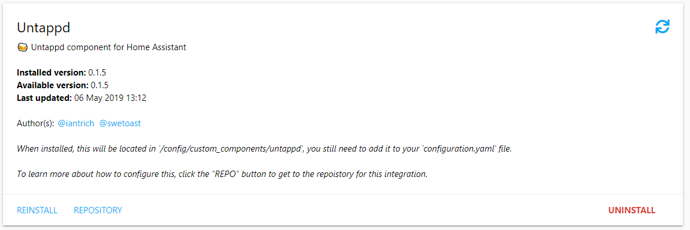

***

[**HOME**](/hacs/) | [INSTALLATION](/hacs/install) | [CONFIGURATION](/hacs/configure) | [TOKEN](/hacs/token)

***

# HACS (Home Assistant Community Store)

## What is it?

This is a manager for your custom integration (components) and plugin (lovelace elements) needs.

It can help you download and update elements.

It cam also help you discover new awesome stuff.

## Updates

It checks for updates every 500 minutes after Home Assistant is started, you can also force a check by clicking the "RELOAD DATA" button under the "SETTINGS" tab.

## Logs

Like any other integration this logs to the `home-assistant.log` file.

You can also click the "OPEN LOG" form the "SETTINGS" tab to show logs only related to this integration (useful when creating a issue)

During the first versions of this it will configure the logger component to use `debug` for this integration. This is done to make sure those exists when you need to report a bug.

## Existing elements

This will not scan you local file system for existing elements.

Why?

Trust. If this did not download it, it can not know which version you have, so for elements you already have you still need to click the "INSTALL" button for that element.

## Data

All data it handles are saved to the `hacs` file that is located under `.storage`

## Note for developers

For your repository to be added there is a few criterias that needs to be met.

[See here for how to add a custom repository.](#add-custom-repos)

The description for each element are gathered from the description of the repository.

The version it shows/uses are gathered from the tag name of the latest release.

If you want to add a richer experience for your users you can add some extra files to the root of your repository (this is optional).

filename | description
-- | --
`example.yaml` | A configuration example for your element.
`example.png` | A Sample image of how this can look.

### Note for integration developers

For a integration repository to be valid these are the criterias:

- The repository uses GitHub releases
- There is only one integration (one directory under `ROOT_OF_THE_REPO/custom_components/`) pr repository (if you have more, only the first one will be managed.)
- The integration (all the python files for it) are located under `ROOT_OF_THE_REPO/custom_components/INTEGRATION_NAME/`
- In that integration directory, there is a [`manifest.json`](https://developers.home-assistant.io/docs/en/creating_integration_manifest.html) file.

A good template to use as a reference are [blueprint](https://github.com/custom-components/blueprint)

### Note for plugin developers

For a integration repository to be valid these are the criterias:

- The repository uses GitHub releases
- There are `.js` files under `ROOT_OF_THE_REPO/dist/` or directly in the root of the repo.
- One of the `.js` files have the same name as the repository.

It will first check the `dist` directory, if nothing there it will check the root. All `.js` files it find will be downloaded.

A good template to use as a reference are [boilerplate-card](https://github.com/custom-cards/boilerplate-card)

## Settings

This section is for the settings tab.

### Add custom repos

By default all elements that meet the requirements from these orgs are automatically added:

- [custom-components](https://github.com/custom-components)
- [custom-cards](https://github.com/custom-cards)

But you can add any other repository that meed the requirements, to do so go to the "SETTINGS" tab.

Add the url to the repository under "Custom integration repo's" or "Custom plugin repo's" depending on the type.

After you add a repository it will scan that repository, if it can be tracked the element from it will show up under "STORE".

Want to get inspiration on what to add, check out the [Awesome Home Assistant list](https://www.awesome-ha.com/) it has has links to some custom_components (integration) and custom_cards (plugin).

## Contribute

This integration is **massive** there are a lot of areas to contribute to.

Contributions to the docs, will almost be blindly accepted.

### For contributions to the integration itself (backend/frontend)

If the contribution is minor, do the change and open a PR (Pull Request).

For new features / Changes to existing features or other big changes, please open an RFC (Request for comment) issue before you start the work.

***

# Image "galery"

## Overview

## Store

## Settings

## Example integration

## Example plugin

# Last notes from the initial developer

This was developed under the influence of 🍺, a lot of 🍺, [if you want to support my work feel free to buy me a ☕️ (most likely 🍺)](meacoffee.com/ludeeus)

How it works and what it does are added based on a single persons mindset, you may not agree with what I have done, if you have a suggestion please open an [RFC](https://github.com/custom-components/hacs/issues)

## Why do frontend like this and not use `JavaScript` in a `panel_custom`?

I tried, believe me I tried, I really wanted to go that route, but after several many many many hours of failing I gave up.

## Bugs / issues / suggestions

If you find bugs/issues or have any suggestions please open an issue in the [HACS Repository](https://github.com/custom-components/hacs/issues)