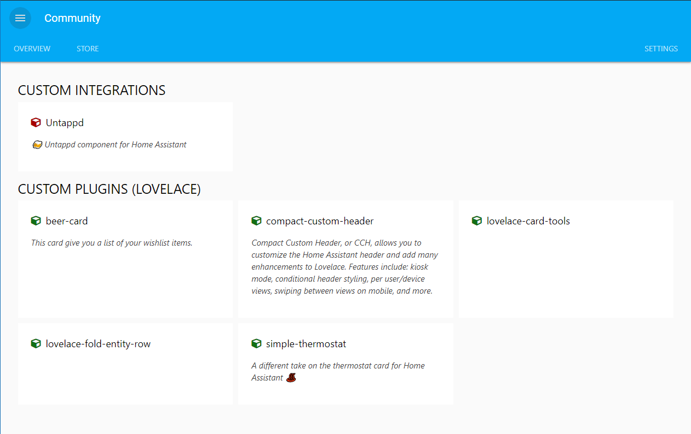
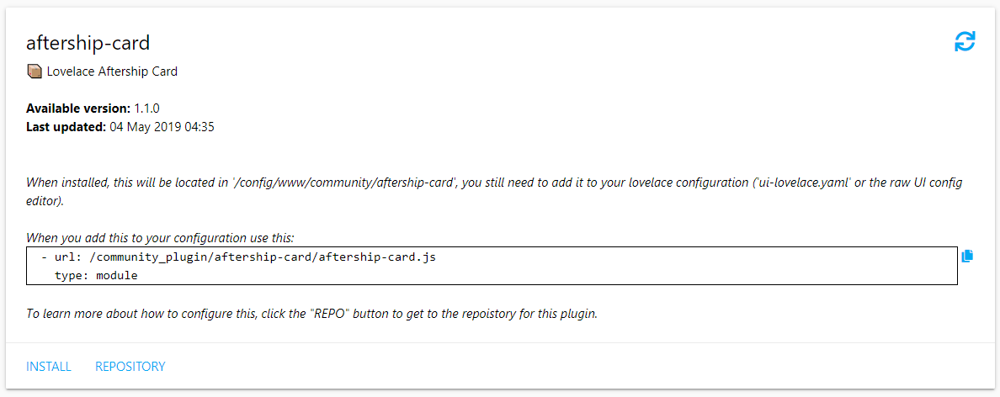

***

[**HOME**](/hacs/) | [INSTALLATION](/hacs/install) | [CONFIGURATION](/hacs/configure) | [TOKEN](/hacs/token)

***

# HACS (Home Assistant Community Store)

## What is it?

This is a manager for your custom integration (components) and plugin (lovelace elements) needs.

It can help you download and update elements.

It can also help you discover new awesome stuff.

## Updates

### Installed elements

HACS will check for updates to installed elements:

- At startup.
- Every 30 minutes after HA startup.

### Everything else

HACS will check for updates to every element:

- At startup
- Every 500 minutes after HA startup.

### Manually trigger updates

You can also force a check by clicking the "RELOAD DATA" button under the "SETTINGS" tab _(This will force a reload of everything.)_

Under the "SETTINGS" tab there is also a reload icon to the left of every custom repository you have added, clicking that will reload info for it.

On each RepositoryView (the page with details about the element) there is a reload icon at the top-right corner, clicking that will reload it.

## Logs

Like any other integration this logs to the `home-assistant.log` file.

You can also click the "OPEN LOG" from the "SETTINGS" tab to show logs only related to this integration (useful when creating a issue)

During the first versions of this it will configure the logger component to use `debug` for this integration. This is done to make sure those exists when you need to report a bug.

## Startup

During the startup it will scan for know repositories, and there will be a progressbar indicating that it's working.

This is completely normal, and you can still use it while it's working.
The same indication will show when a scheduled task is running.

## Existing elements

This will not scan you local file system for existing elements.

Why?

Trust. If this did not download it, there'd be no way to know which version you have, so for elements you already have you will still need to click the "INSTALL" button for that element.

## Data

All data it handles are saved to the `hacs` file that is located under `.storage`

## Note for developers

For your repository to be added there are a few criteria that need to be met.

[See here for how to add a custom repository.](#add-custom-repos)

The description of each element is gathered from it's repository.

The version it shows/uses is gathered from the tag name of the latest release.

If you want to add a richer experience for your users you can add an `info.md` file to the root of your repository (this is optional), this file will be rendered under the repository description, it does not support the full styling options as Github so use with care.

### Include default repositories

As a developer you can now add your repository to be included in as a default repository in the store.

Before you try to add your repository to the default store first make sure that it follows the requirements for that type that are listed below.

Only the owner of the repository or a major contributer to it can submit a PR to have it included as a default.

When all of this is covered, you can add it to `DEFAULT_REPOSITORIES` at the bottom of the [`const.py file`](https://github.com/custom-components/hacs/blob/master/custom_components/hacs/const.py)

**Examples:**

- [`integration`](https://github.com/custom-components/hacs/pull/64)
- [`plugin`](https://github.com/custom-components/hacs/pull/65)

### Note for integration developers

For an integration repository to be valid these are the criteria:

- The repository uses GitHub releases (Optional)
  - If there are releases:
    - When installing/upgrading it will scan the content in the latest release.
  - If there are no releases:
    - An update will not be possible (but the user will still be able to install/reinstall it).
    - It will scan files in the branch marked as default.
- There is only one integration (one directory under `ROOT_OF_THE_REPO/custom_components/`) pr. repository (if you have more, only the first one will be managed.)
- The integration (all the python files for it) are located under `ROOT_OF_THE_REPO/custom_components/INTEGRATION_NAME/`
- There is only one integration (one directory under `ROOT_OF_THE_REPO/custom_components/`) per repository (if you have more, only the first one will be managed.)
- The integration and all the python files for it are located under `ROOT_OF_THE_REPO/custom_components/INTEGRATION_NAME/`

- In that integration directory, there is a [`manifest.json`](https://developers.home-assistant.io/docs/en/creating_integration_manifest.html) file.

A good template to use as a reference is [blueprint](https://github.com/custom-components/blueprint)

### Note for plugin developers

For an integration repository to be valid these are the criteria:

- The repository uses GitHub releases (Optional)
  - If there are releases:
    - When installing/upgrading it will scan the content in the latest release.
  - If there are no releases:
    - An update will not be possible (but the user will still be able to install/reinstall it).
    - It will scan files in the branch marked as default.

- There are `.js` files under `ROOT_OF_THE_REPO/dist/` or directly in the root of the repository.
- One of the `.js` files have the same name as the repository.
  - With every rule there is an exception, if the repository's name starts with `"lovelace-"`, there must be a `.js` file in the repository matching the repository name with `"lovelace-"` striped from the name, examples:
    - Accepted:
      - repository name: "lovelace-awesome-card"
      - file name of one of the files "awesome-card"
    - Not accepted:
      - repository name: "lovelace-awesome-card"
      - file name of one of the files "lovelace-awesome-card"

It will first check the `dist` directory, if nothing is there it will check the root directory. All `.js` files it finds will be downloaded.

A good template to use as a reference is [boilerplate-card](https://github.com/custom-cards/boilerplate-card)

## Sensor

During the setup HACS will add a new sensor to your installation (`sensor.hacs`).
This will have the number of pending updates as the state.

## Settings

This section is for the settings tab.

### Add custom repos

By default all elements that meet the requirements from these orgs are automatically added:

- [custom-components](https://github.com/custom-components)
- [custom-cards](https://github.com/custom-cards)

[_developers can also add their repositories to be included by default_](https://custom-components.github.io/hacs/#include-default-repositories)

But you can add any other repository that meets the requirements, to do so go to the "SETTINGS" tab.

Add the url to the repository under "Custom integration repo's" or "Custom plugin repo's" depending on the type.

After you add a repository it will scan that repository, if it can be tracked the element will show up under "STORE".

Want to get inspiration on what to add? Check out the [Awesome Home Assistant list](https://www.awesome-ha.com/) it has has links to many custom_components (integration) and custom_cards (plugin).

## Contribute

This integration is **massive** and there are a lot of areas to contribute to.

Contributions to the docs, will almost be blindly accepted.

### For contributions to the integration itself (backend/frontend)

If the contribution is minor, make the change and open a PR (Pull Request).

For new features, changes to existing features, or other big changes, please open an RFC (Request for comment) issue before you start the work.

***

# Image "gallery"

## Overview

## Store

## Settings

## Example integration

## Example plugin

# Last notes from the initial developer

First startup after installation will take some time, but it's worth it.

This was developed under the influence of 🍺, a lot of 🍺, [if you want to support my work feel free to buy me a ☕️ (most likely 🍺)](https://buymeacoffee.com/ludeeus)

How it works and what it does are added based on a single persons mindset, you may not agree with what I have done, if you have a suggestion please open an [RFC](https://github.com/custom-components/hacs/issues).

## Why do frontend like this and not use `JavaScript` in a `panel_custom`?

I tried, believe me I tried. I really wanted to go that route, but after many, many hours of failing I gave up.

## Bugs / issues / suggestions

If you find bugs/issues or have any suggestions please open an issue in the [HACS Repository](https://github.com/custom-components/hacs/issues)
